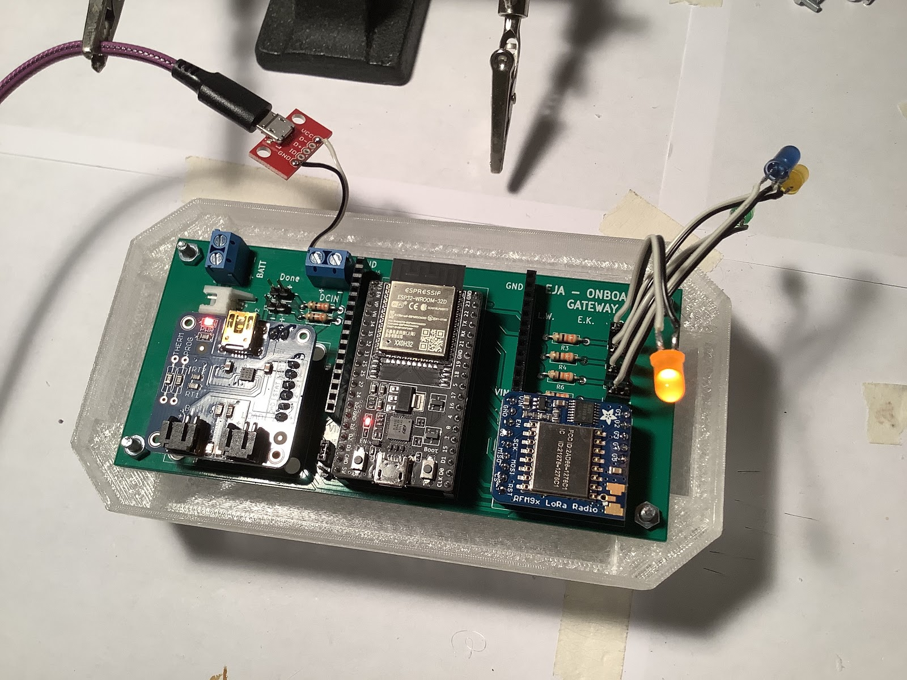
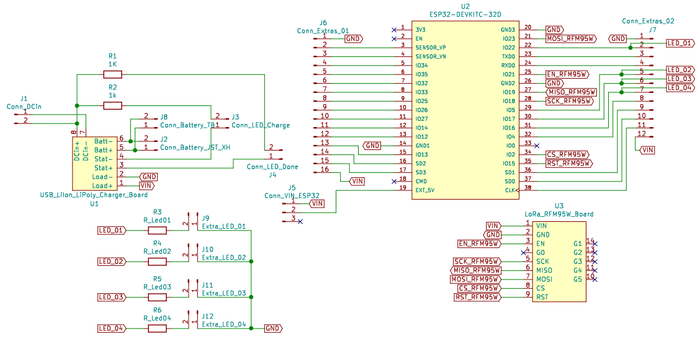
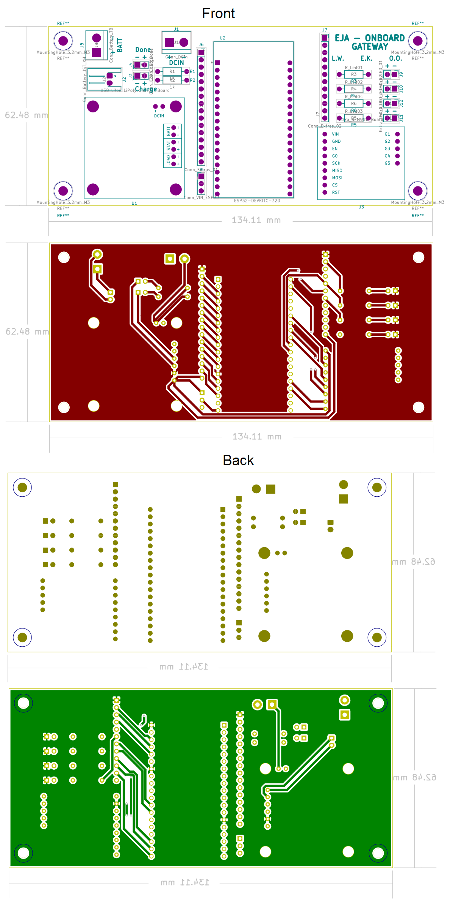
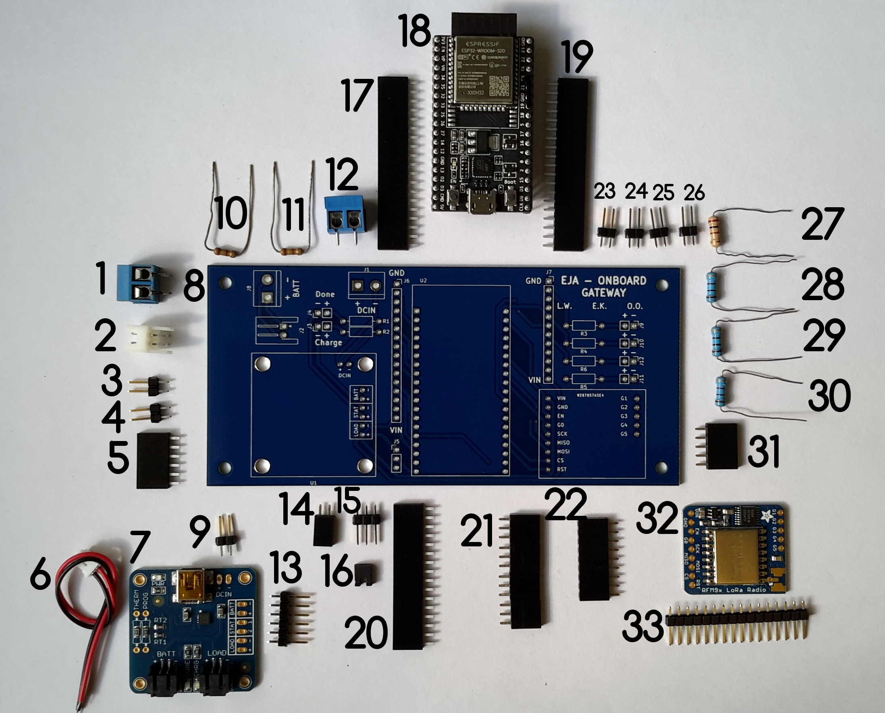
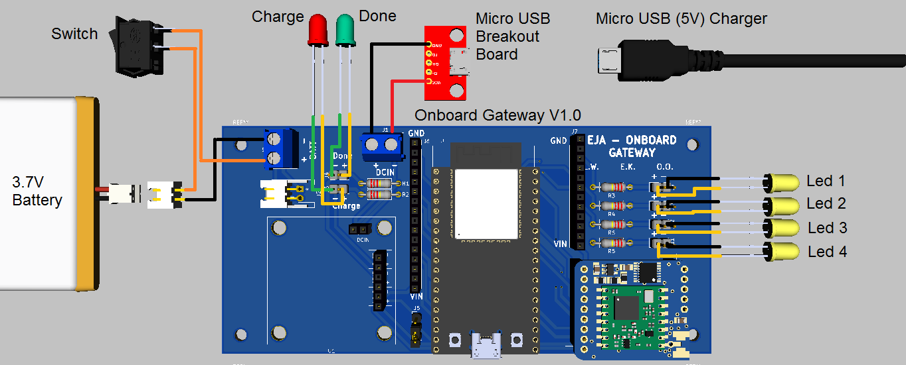

# EJA Onboard Gateway - Electronic Design

EJA Onboard Gateway - Electronic Design - 2020 Hackaday Dream Team Challenge for Conservation X Labs

This repository contains the KiCad design for the PCB of the Onboard Gateway. It also contains the 3D models used to visualize the design in the KiCad 3D viewer.

## Main Components ##

## Schematic ##

## PCB Layout ##

## Assembly ##

## Wiring Diagrams ##

