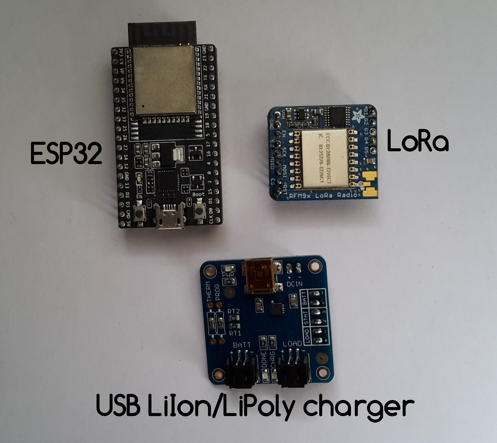

# EJA Onboard Gateway - Electronic Design

EJA Onboard Gateway - Electronic Design - 2020 Hackaday Dream Team Challenge for Conservation X Labs

This repository contains the KiCad design for the PCB of the Onboard Gateway. It also contains the 3D models used to visualize the design in the KiCad 3D viewer.

## Main Components ##

## Schematic ##

## PCB Layout ##

## Assembly ##

Components List:

1. [TERM BLK 2P SIDE ENT 5.08MM PCB](https://www.digikey.com/product-detail/es/on-shore-technology-inc/OSTTC022162/ED2609-ND/614558)
2. [CONN HEADER R/A 2POS 2.5MM](https://www.digikey.com/product-detail/es/jst-sales-america-inc/S2B-XH-A-1-LF-SN/455-4226-ND/9961922)
3. [CONN HEADER VERT 2POS 2.54MM](https://www.digikey.com/product-detail/es/3m/2340-6111TG/3M11928-ND/1237275)
4. [CONN HEADER VERT 2POS 2.54MM](https://www.digikey.com/product-detail/es/3m/2340-6111TG/3M11928-ND/1237275)
5. [CONN HDR 6POS 0.1 TIN PCB](https://www.digikey.com/product-detail/es/sullins-connector-solutions/PPTC061LFBN-RC/S7004-ND/810145)
6. 2POS JST cable (included in the [USB LiIon/LiPoly charger](https://www.adafruit.com/product/259))
7. [USB LiIon/LiPoly charger](https://www.adafruit.com/product/259)
8. Onboard Gateway V1.0
9. [CONN HEADER VERT 2POS 2.54MM](https://www.digikey.com/product-detail/es/3m/2340-6111TG/3M11928-ND/1237275)
10. [RES 249 OHM 1/4W 1% AXIAL](https://www.digikey.com/product-detail/en/stackpole-electronics-inc/RNF14FTD249R/RNF14FTD249RCT-ND/1974990)
11. [RES 249 OHM 1/4W 1% AXIAL](https://www.digikey.com/product-detail/en/stackpole-electronics-inc/RNF14FTD249R/RNF14FTD249RCT-ND/1974990)
12. [TERM BLK 2P SIDE ENT 5.08MM PCB](https://www.digikey.com/product-detail/es/on-shore-technology-inc/OSTTC022162/ED2609-ND/614558)
13. [CONN HEADER VERT 6POS 2.54MM](https://www.digikey.com/product-detail/es/3m/2340-6111TG/3M11928-ND/1237275)
14. [CONN HDR 2POS 0.1 GOLD PCB](https://www.digikey.com/product-detail/es/sullins-connector-solutions/PPPC021LFBN-RC/S7035-ND/810174)
15. [CONN HEADER VERT 3POS 2.54MM](https://www.digikey.com/product-detail/es/3m/2340-6111TG/3M11928-ND/1237275)
16. [CONN JUMPER SHORTING .100" GOLD](https://www.digikey.com/product-detail/es/sullins-connector-solutions/QPC02SXGN-RC/S9337-ND/2618262)
17. [CONN HDR 19POS 0.1 TIN PCB](https://www.digikey.com/product-detail/es/sullins-connector-solutions/PPTC191LFBN-RC/S7017-ND/810157)
18. [ESP32-DEVKITC-32D](https://www.digikey.com/product-detail/es/espressif-systems/ESP32-DEVKITC-32D/1965-1000-ND/9356990)
19. [CONN HDR 19POS 0.1 TIN PCB](https://www.digikey.com/product-detail/es/sullins-connector-solutions/PPTC191LFBN-RC/S7017-ND/810157)
20. [CONN HDR 16POS 0.1 TIN PCB](https://www.digikey.com/product-detail/es/sullins-connector-solutions/PPTC161LFBN-RC/S7014-ND/810154)
21. [CONN HDR 12POS 0.1 TIN PCB](https://www.digikey.com/product-detail/es/sullins-connector-solutions/PPTC121LFBN-RC/S6100-ND/807231) (I used 2 [CONN HDR 6POS 0.1 TIN PCB](https://www.digikey.com/product-detail/es/sullins-connector-solutions/PPTC061LFBN-RC/S7004-ND/810145) in the image)
22. [CONN HDR 9POS 0.1 GOLD PCB](https://www.digikey.com/product-detail/es/sullins-connector-solutions/PPPC091LFBN-RC/S7042-ND/810181)
23. [CONN HEADER VERT 2POS 2.54MM](https://www.digikey.com/product-detail/es/3m/2340-6111TG/3M11928-ND/1237275)
24. [CONN HEADER VERT 2POS 2.54MM](https://www.digikey.com/product-detail/es/3m/2340-6111TG/3M11928-ND/1237275)
25. [CONN HEADER VERT 2POS 2.54MM](https://www.digikey.com/product-detail/es/3m/2340-6111TG/3M11928-ND/1237275)
26. [CONN HEADER VERT 2POS 2.54MM](https://www.digikey.com/product-detail/es/3m/2340-6111TG/3M11928-ND/1237275)
27. [RES 100 OHM 3W 5% AXIAL](https://www.digikey.com/product-detail/en/vishay-beyschlag-draloric-bc-components/AC03000001000JAC00/PPC3W100CT-ND/596604)
28. [RES 100 OHM 3W 5% AXIAL](https://www.digikey.com/product-detail/en/vishay-beyschlag-draloric-bc-components/AC03000001000JAC00/PPC3W100CT-ND/596604)
29. [RES 100 OHM 3W 5% AXIAL](https://www.digikey.com/product-detail/en/vishay-beyschlag-draloric-bc-components/AC03000001000JAC00/PPC3W100CT-ND/596604)
30. [RES 100 OHM 3W 5% AXIAL](https://www.digikey.com/product-detail/en/vishay-beyschlag-draloric-bc-components/AC03000001000JAC00/PPC3W100CT-ND/596604)
31. [CONN HDR 5POS 0.1 GOLD PCB](https://www.digikey.com/product-detail/es/sullins-connector-solutions/PPTC051LFBN-RC/S6103-ND/807239)
32. [RFM95W LoRa Radio](https://www.digikey.com/product-detail/es/adafruit-industries-llc/3072/1528-1667-ND/6005357)
33. CONN HEADER VERT 16POS 2.54MM (included in [RFM95W LoRa Radio](https://www.digikey.com/product-detail/es/adafruit-industries-llc/3072/1528-1667-ND/6005357))

## Wiring Diagrams ##

